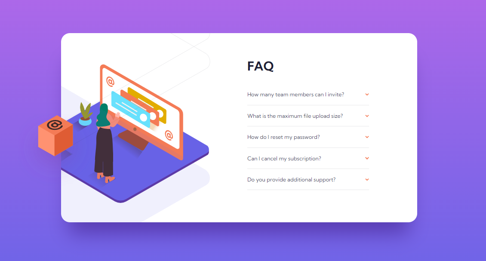

# Project - FAQ accordion card

### The challenge

Users should be able to:

- View the optimal layout for the component depending on their device's screen size
- See hover states for all interactive elements on the page
- Hide/Show the answer to a question when the question is clicked

### Screenshot

### Links

- Solution URL: https://github.com/giorgisilagadze/FAQ
- Live Site URL: https://faq-rouge.vercel.app/

### Built with

- Semantic HTML5 markup
- CSS custom properties
- Flexbox
- Mobile-first workflow
- Javascript

### What I learned

I've learned how to use DOM manipulations.